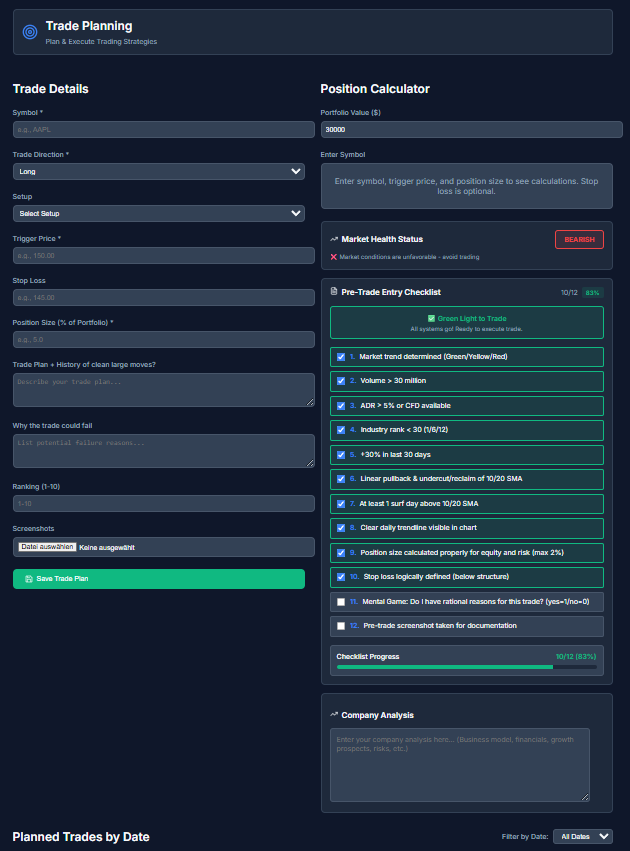
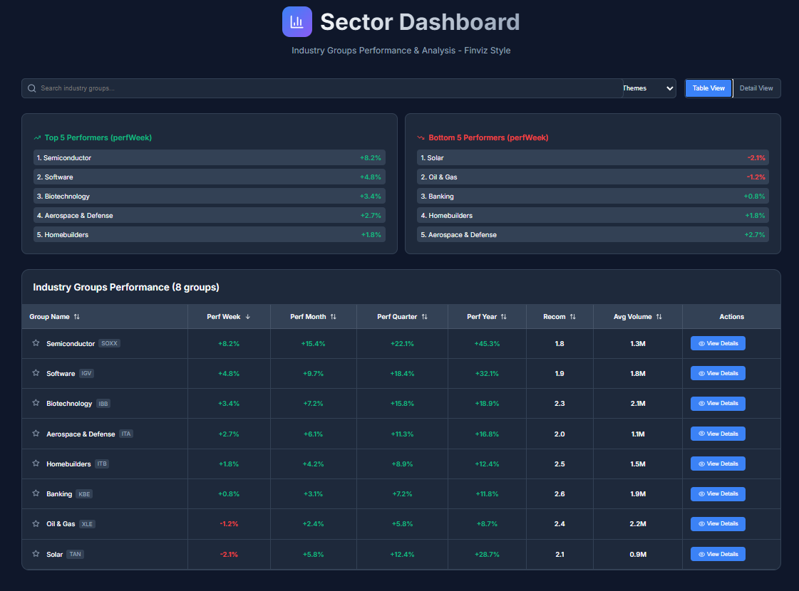

# Trading Journal

Ein Trading-Journal, das die Qualität einer Entscheidung vom Ergebnis trennt.
Gebaut 2025, damit ich messen kann, ob ich mich an mein eigenes System gehalten
habe.

## Warum

Ich handle Aktien, seit ich siebzehn bin. Irgendwann habe ich gemerkt, dass
Bauchgefühl nicht trägt. Man braucht klare Regeln, und man braucht ein System,
das festhält, ob man ihnen gefolgt ist.

Der Grund dafür ist nicht Disziplin, sondern Messbarkeit. **Ein guter Trade
kann ein Verlust-Trade sein.** Wenn ich mich an mein System gehalten habe und es
geht trotzdem schief, war die Entscheidung richtig und ich ändere nichts. Wenn
ich mich nicht daran gehalten habe und es geht gut, war es Glück, und daraus
lerne ich das Falsche. Ohne diese Trennung bewertet man jeden Trade nach dem
Ausgang, und dann optimiert man auf Zufall.

Deshalb trägt hier jeder Trade ein Feld, ob die Regeln eingehalten wurden, und
wenn nicht, warum. Erst dadurch werden Anpassungen prüfbar: wenn ich das Risiko
pro Position senke oder ein Setup streiche, sehe ich hinterher an den Zahlen, ob
es gewirkt hat, statt es zu glauben.

Die Kriterien selbst sind hart und nicht verhandelbar. Volumen über 30
Millionen, ADR über 5 Prozent, maximal 2 Prozent Risiko pro Position, Stop
unter der Struktur. Sie stehen als Pflicht-Checkliste vor der Eingabe.

## Was drin steckt

**Eine Checkliste vor jedem Einstieg.** Zwölf Punkte mit harten Zahlen, kein
Bauchgefühl. Sie steht in `src/components/TradePlanning.js` und läuft vor der
Eingabe, nicht danach. Der Trade lässt sich auch mit unvollständiger Liste
speichern, aber dann steht es in den Daten.



**Regeltreue als Datenfeld.** `ruleAdherence` und `ruleViolationReason` liegen an
jedem Trade. Damit ist die Frage "war das Pech oder war ich es" auswertbar statt
Erinnerung.

**Ein Wochenbericht, den ein Sprachmodell schreibt.** `src/services/aiAnalysis.js`
baut aus den Trades der Woche einen Prompt, schickt ihn an die Anthropic-API und
zerlegt die Antwort. Drei Stellen darin sind die interessanten:

- Der Prompt endet mit der Anweisung, **keine Empfehlungen** zu geben, sondern
  nur eine faktische Zusammenfassung für die manuelle Durchsicht. Ich wollte
  eine Auswertung, keinen Ratgeber.
- Die Daten werden auf zwanzig Trades und feste Feldlängen beschnitten, bevor
  sie rausgehen.
- Es gibt einen `createFallbackAnalysis`, der die Zahlen lokal rechnet, wenn die
  API nicht antwortet. Der Bericht kommt also auch dann.

**Eigene Speicher- und Migrationsschicht.** `src/utils/storage.js`,
`migration.js` und `dataValidation.js`. Die Daten liegen in der IndexedDB des
Browsers, und ältere Datenstände werden beim Start auf das aktuelle Schema
gehoben.

## Was ich heute anders machen würde

**Der API-Schlüssel gehört nicht in den Browser.** Er kam früher direkt aus
dem Code, jetzt aus der Umgebung, aber bei Create React App landet auch eine
`REACT_APP_`-Variable beim Bauen fest im Bundle. Richtig wäre ein kleiner
eigener Server, der den Aufruf macht und den Schlüssel behält. Für eine App,
die nur lokal bei mir läuft, war das kein Problem. Für eine, die jemand
aufruft, wäre es eins.

**Einzelne Komponenten sind zu groß geworden.** `TradingEquityCurve.js` hat
über 4.000 Zeilen. Das ist gewachsen und nicht geschnitten.

**Der Depotwert hat vier Quellen und keine gewinnt zuverlässig.** Er steht als
Einstellung in der IndexedDB, wird beim Laden aber aus drei localStorage-Listen
überschrieben (`equityCurve`, `manualEquityEntries`, `currentEquity`, jeweils
der höchste Wert), und wenn keine davon etwas hergibt, fällt der Code auf eine
fest verdrahtete Zahl zurück. Alle Prozentangaben im Risiko-Dashboard hängen
daran. Aufgefallen ist es, weil Positionsgrößen über 200 Prozent des Depots
angezeigt wurden, obwohl sie auf 22 Prozent gedeckelt waren: gerechnet wurde
gegen einen anderen Depotwert als den gesetzten. Ein Wert gehört an eine
Stelle.

**Vier Abhängigkeiten liegen ungenutzt in der `package.json`.** `date-fns`,
`papaparse`, `xlsx` und `react-router-dom` sind installiert, aber in keiner
Datei importiert. Das CSV-Lesen macht `TradeUpload.js` von Hand, und Routing
gibt es keins, die Navigation läuft über einen State. Angefangen und dann
anders gelöst, ohne aufzuräumen.

## Funktionen

**Dashboard.** Trade-Eingabe von Hand, Teil- und Komplettverkäufe, dazu die
Kennzahlen: Trefferquote, Netto-Ergebnis, Erwartungswert, Profitfaktor,
Durchschnitt und Extremwerte je Trade.

**Verlauf.** Kumulatives Ergebnis über die Zeit als Kurve, mit Zeitraum-Filter
von heute bis alles.

**Portfolio.** Alle Trades mit Suche, Filter und Sortierung, Export als CSV.

**Journal.** Notizen und Lehren je Trade, durchsuchbar.

**Wochenrückblick.** Der KI-Bericht oben, plus eine lokale Auswertung als
Rückfallebene.

**Sektor-Übersicht.** Branchengruppen nach Woche, Monat, Quartal und Jahr, um
zu sehen, wo überhaupt Bewegung ist, bevor ein einzelner Wert geprüft wird.



## Wo die Daten liegen

Trades, Verkäufe und Einstellungen liegen in der **IndexedDB des Browsers**,
also auf dem eigenen Rechner. Kein Server, kein Konto, kein Tracking.

**Eine Ausnahme, und sie ist wichtig:** wer den KI-Wochenbericht benutzt,
schickt die Trades dieser Woche an die Anthropic-API. Ohne Schlüssel passiert
das nicht, dann rechnet die lokale Rückfallebene.

## Stack

React 18, Recharts und Chart.js für die Diagramme, Lucide für die Icons,
eigenes CSS ohne Framework, IndexedDB als Speicher, Anthropic-API für den
Wochenbericht.

## Demo-Daten

Wer das Projekt frisch startet, sieht eine leere App. `scripts/seed-demo-data.js`
schreibt 39 **erfundene** Trades in die IndexedDB, 34 geschlossene und 5 offene:
keine echten Positionen, keine echten Kurse.

Der Datensatz ist nicht zufällig gestreut, er zeigt die Aussage oben. Die 26
Trades mit eingehaltenen Regeln machen zusammen rund 9.600, die 8 Regelbrüche
kosten rund 2.400. Unterm Strich steht ein Plus, und trotzdem sieht man in der
Regeltreue-Spalte, wo das Geld verloren geht. Genau diese Trennung soll das
Werkzeug sichtbar machen.

App starten, F12 drücken, den Inhalt der Datei in die Console kopieren, Seite
neu laden. Entfernen mit `seedDemoData.remove()`, das fasst nur Zeilen mit
`isDemo: true` an.

## Lokal starten

```bash
npm install
cp .env.example .env    # Anthropic-Schlüssel eintragen, optional
npm start
```

Läuft auf `http://localhost:3000`. Ohne Schlüssel funktioniert alles außer
dem KI-Wochenbericht, der fällt dann auf die lokale Auswertung zurück.
